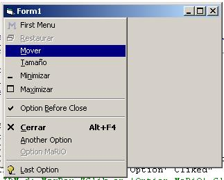



## Controling the System Menu

### Description

Insert items in the system menu (with icons). Delete Menus. Easy to understand
 
### More Info
 

             |
---                |---
**Submitted On**   |2002-08-17 17:17:40
**By**             |[MaRiØ G\. Serrano](https://github.com/Planet-Source-Code/PSCIndex/blob/master/ByAuthor/mari-g-serrano.md)
**Level**          |Advanced
**User Rating**    |5.0 (105 globes from 21 users)
**Compatibility**  |VB 6\.0
**Category**       |[Windows API Call/ Explanation](https://github.com/Planet-Source-Code/PSCIndex/blob/master/ByCategory/windows-api-call-explanation__1-39.md)
**World**          |[Visual Basic](https://github.com/Planet-Source-Code/PSCIndex/blob/master/ByWorld/visual-basic.md)
**Archive File**   |[Controling842415172002\.zip](https://github.com/Planet-Source-Code/mari-g-serrano-controling-the-system-menu__1-34882/archive/master.zip)

